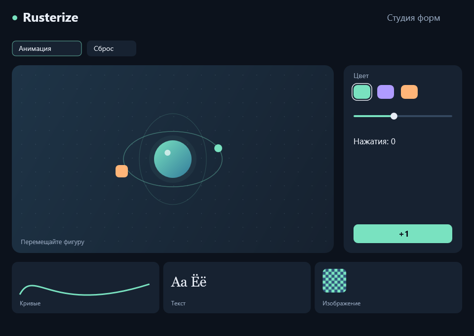
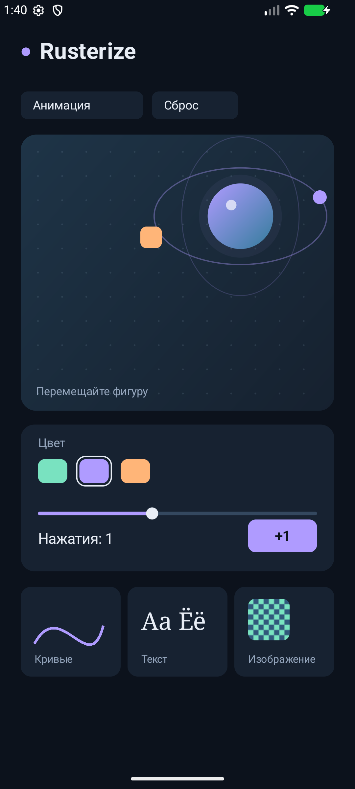

# Rusterize

[](https://github.com/USBashka/Rusterize/actions/workflows/ci.yml)

Rust-фреймворк для приложений с доступом к возможностям своей ОС. Один `Application` отвечает за состояние, ввод и рисунок; платформенная оболочка создаёт окно и исполняет команды.

| Платформа | Рисование | Оболочка |
| --- | --- | --- |
| Windows 10/11 | Direct2D + DirectWrite | Win32, Rust |
| Android 8+ | `android.graphics.Canvas` | Небольшой Java View + JNI |
| Linux | Cairo + Pango | GTK 4, C |
| macOS 11+ | Core Graphics + TextKit | AppKit, Swift |

В приложении нет WebView, Chromium, поставляемой копии Skia или отдельного GPU-движка. Android сам использует свой системный графический стек. GTK/Cairo/Pango в Linux устанавливаются как системные зависимости. Rust-ядро без нативного Windows-бэкенда и опциональной feature `shaders` не имеет сторонних зависимостей на настольных ОС.

Это первая версия 0.1. Статус реальных проверок, размеры файлов и ограничения перечислены в [VALIDATION.md](docs/VALIDATION.md). Наличие адаптера не означает, что он проверен на всех устройствах.

| Windows: нативный Direct2D-кадр | Android: работающий пример в эмуляторе |
| --- | --- |
|  |  |

## Запустить пример

Нужен Rust 1.85+; для сборочных сценариев — Python 3.10+.

```powershell
cargo run -p rusterize-gallery --bin gallery
python scripts/build.py --platform windows
```

Готовый файл: `dist/gallery.exe`. Release-сборка использует статический CRT. В примере работают анимация, перетаскивание, смена цвета, размер фигуры и счётчик. Клавиатура: Tab / Shift+Tab, Enter / пробел, стрелки, Escape.

```sh
# Android: SDK, NDK, JDK 17+, установленные цели Rust
rustup target add aarch64-linux-android
python scripts/build.py --platform android --ndk /path/to/ndk

# Linux: GTK 4 и Pango development packages, C compiler, pkg-config
python3 scripts/build.py --platform linux

# macOS: Xcode Command Line Tools
python3 scripts/build.py --platform macos
```

Android APK подписывается локальным **отладочным** ключом для установки и проверки. Для магазина нужны собственная подпись, идентификатор и процесс выпуска. Сборщик не устанавливает APK автоматически. Можно добавить `--abi x86_64` для эмулятора или две опции `--abi` для двух архитектур. Оболочка не запрашивает интернет, хранилище или другие разрешения.

Готовые сборки находятся в разделе Artifacts [успешного запуска CI](https://github.com/USBashka/Rusterize/actions/workflows/ci.yml). Для Linux/macOS используй вложенный `.tar.gz`: он сохраняет права запуска. Распаковать: `tar -xzf rusterize-gallery-linux.tar.gz` или `tar -xzf rusterize-gallery-macos.tar.gz`. macOS-приложение имеет локальную ad hoc подпись, без notarization Apple.

## Создать приложение

```sh
cargo run -p rusterize-cli -- new ../hello-rusterize
cd ../hello-rusterize
python scripts/build.py --platform windows
```

Генератор создаёт самостоятельный проект, копирует тонкие платформенные оболочки и руководства, подключает Rust-библиотеку через локальную `path`-зависимость. Для другого расположения фреймворка есть `--framework /path/to/Rusterize`. Пакет пока не опубликован на crates.io.

Минимальное приложение:

```rust
use rusterize::*;

#[derive(Default)]
pub struct App;

impl Application for App {
    fn draw(&mut self, canvas: &mut Canvas<'_>, viewport: Viewport) {
        canvas.clear(Color::hex(0x101923));
        canvas.circle(
            (viewport.size.width / 2.0, viewport.size.height / 2.0),
            48.0,
            Color::hex(0x79e2c0),
        );
        canvas.text("Привет, мир!", (24.0, 48.0), TextStyle::new(24.0, Color::WHITE));
    }
}

rusterize::export_app!(App);
```

Windows вызывает `rusterize::run_app(App)`. На остальных платформах `export_app!` связывает этот же тип с нативной оболочкой; бизнес-логику на Java, Swift или C писать не нужно.

## Оформление окна

Задайте начальные параметры через `Application::window_options`:

```rust
fn window_options(&self) -> rusterize::WindowOptions {
    use rusterize::*;
    WindowOptions::default()
        .with_title("Моё приложение")
        .with_size(960.0, 680.0)
        .with_title_bar(TitleBarStyle::colors(
            Color::hex(0x101923),
            Color::hex(0xe8edf5),
        ).with_border(Color::hex(0x31577b)))
}
```

Во время работы доступны `Context::set_title` и `Context::set_title_bar`. `TitleBarStyle::default()` возвращает системные цвета. В Windows 11 цветами управляет DWM; системные кнопки, resize и Snap сохраняются. В Windows 10 неподдерживаемые цвета остаются системными. Возможности других оболочек перечислены в [API](docs/API.md).

## Возможности и контракт

- Прямоугольники, скругления, эллипсы, линии и составные кубические пути.
- Заливка, обводка, прозрачность, двухцветные линейные градиенты.
- Вложенные трансформации и отсечение произвольными путями.
- Нативные метрики и многострочная раскладка Unicode, переносы, выравнивание и диапазоны строк для пагинации.
- Системные и именованные шрифты, жирное и курсивное начертания, подчёркивание и зачёркивание.
- RGBA-изображения с прозрачностью и нативным кэшированием.
- Опциональные WGSL-шейдеры элементов: параметры, входная текстура, Naga только при сборке. [API, пример и ограничения](docs/SHADERS.md).
- Логические пиксели, DPI, изменение размеров окна.
- Цвета заголовка, изменение названия окна, минимальный размер и запрет resize.
- Указатели, мультитач Android, клавиатура, колесо, фокус, пауза и возобновление.
- Очередь системных запросов: буфер обмена, курсор, окно, диалоги и открытие URI; доступность зависит от ОС.
- Прямой доступ к нативным объектам рисования и оболочки через `Application::native_draw`; сообщения Win32 через `native_event`.
- Перерисовка по запросу; анимация включается приложением и останавливается при приостановке.
- Проверка display list, явные ошибки и нативный offscreen-рендерер Windows для тестов.

Одинаковы координаты, геометрия, порядок команд и модель приложения. Пиксели текста и края фигур могут отличаться из-за системных шрифтов, сглаживания и цветовой интерполяции. Если нужна идентичность каждого пикселя, нативные Canvas не дают такого обещания.

Принцип расширения: общий API для совместимых операций и доступ к исходным объектам SDK для платформенных возможностей. Набор общих методов не должен ограничивать приложение возможностями самой бедной платформы. Это ещё не полная высокоуровневая обёртка всех системных SDK. Таблица поддержки и работающий пример: [нативный API](docs/NATIVE_API.md).

Подробнее: [API](docs/API.md), [архитектура](docs/ARCHITECTURE.md), [формат команд и C ABI](docs/protocol.md). Для ИИ предназначен [SKILL.md](SKILL.md).

Пример шейдеров: `python scripts/build.py --platform windows --package rusterize-shaders` (также Android, Linux и macOS). WGSL выполняется через системный OpenGL/OpenGL ES; результат передаётся в нативный Canvas как Image. Этот путь включает GPU readback и предназначен прежде всего для небольших эффектов. Без feature `shaders` зависимости и размер обычного приложения не растут.

## Проверки

```sh
cargo fmt --all --check
cargo clippy --workspace --all-targets -- -D warnings
cargo test --workspace
cargo test -p rusterize --no-default-features
cargo bench -p rusterize --bench scene --no-default-features
cargo doc --workspace --no-deps
```

Лицензия: MIT OR Apache-2.0. Системные библиотеки и инструменты сборки имеют собственные лицензии.
